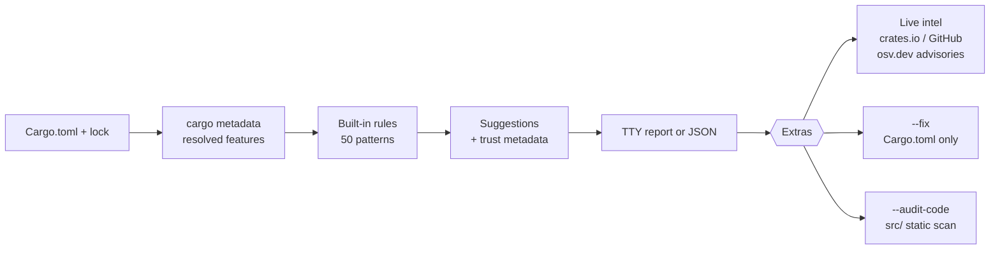
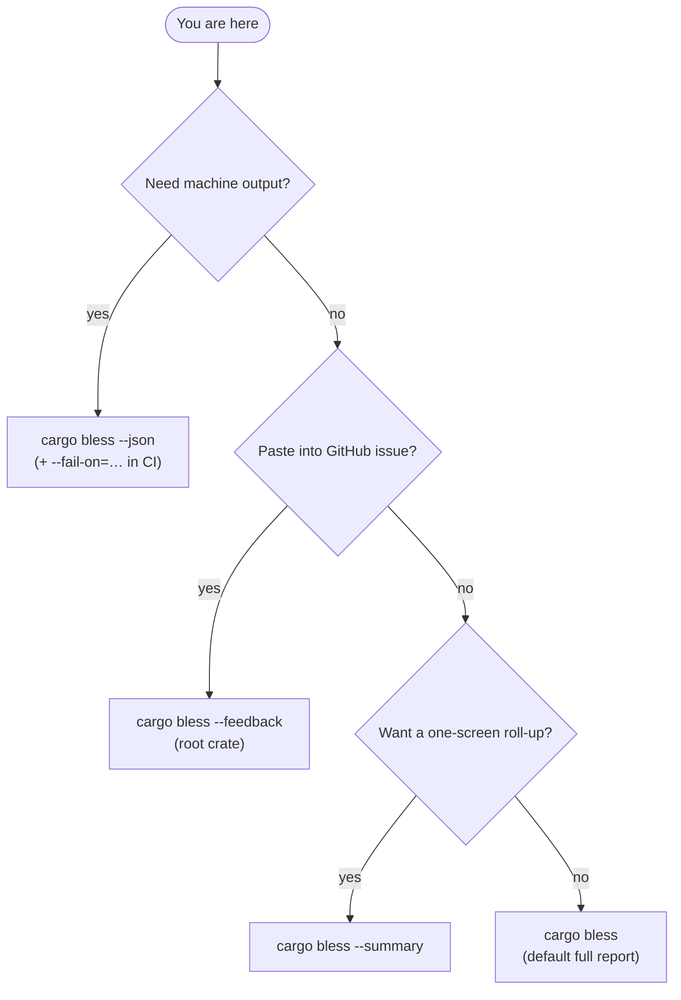
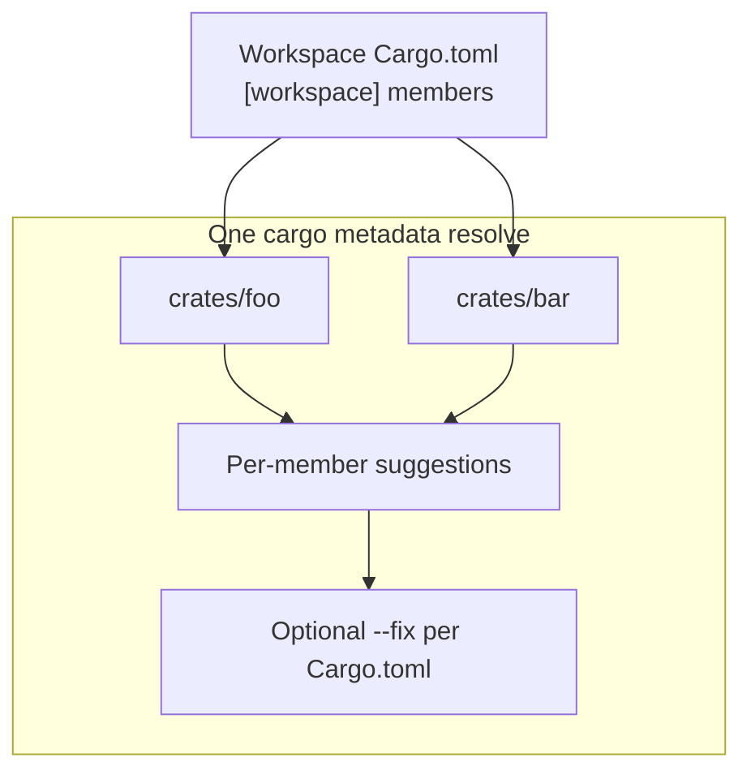

# cargo-bless

A Cargo subcommand that checks your dependencies against [blessed.rs](https://blessed.rs/) recommendations and suggests modern alternatives.

<div align="center">


[](https://crates.io/crates/cargo-bless)
[](https://docs.rs/cargo-bless)
[](LICENSE-MIT)
[](https://github.com/Ruffian-L/cargo-bless/blob/main/Cargo.toml#L5)

<sub>Powered by **[blessed.rs](https://blessed.rs/)** curated paths · optional crates.io + GitHub intel · optional **Cargo.toml‑only** autofix</sub>

</div>

**On crates.io:** [cargo-bless](https://crates.io/crates/cargo-bless) · **Generated API docs:** [docs.rs/cargo-bless](https://docs.rs/cargo-bless) · **Changelog:** [changelog.md](https://github.com/Ruffian-L/cargo-bless/blob/main/changelog.md) · **Repo docs:** [`docs/`](https://github.com/Ruffian-L/cargo-bless/tree/main/docs)

`cargo-bless` checks whether your Rust dependency tree is modern, boring, and defensible.

## At a glance

<div align="center">


</div>



### Which command should I run?



### Release framing (semver)

| Version | What it represented |
|---------|---------------------|
| **0.1.0** | Birth |
| **0.1.1–0.1.3** | Rapid hardening |
| **0.1.4** | First “people might actually try this” slice — think *how does a stranger feel after running this once?* |
| **0.1.7–0.1.8** | Rule merges, blessed.rs ingest, HTML-stripped notes |
| **0.2.0** | `--workspace`, `--summary`, `--fail-on`, JSON per-package, virtual-workspace-safe |
| **0.2.1–0.2.3** | `--all-targets`, `bs --sarif`, `bs --fail-on-confidence`, `--init-ci`, policy gates |
| **0.2.4–0.2.6** | +17 rules (50 total), `--explain`, `--init-hooks`, `bs --fix`, `bs --diff` |
| **0.2.7** | New detectors (BoolComparison, StringAntiPattern, DiscardedError, LossyUtf8), 5 more rules, `bs --fix --dry-run` |
| **0.3.0** | Security advisories via osv.dev, advisory data in JSON output, `--no-advisories` |
| **0.3.1** | False-positive elimination: `#[test]` / `#[cfg(test)]` blocks masked via tree-sitter; default scan scope narrowed to `src/` (use `--include-tests` to opt in); non-`src/` crate layouts now scanned correctly |

## What it does

- Scans your `Cargo.toml` dependency tree (direct + transitive, with features)
- Matches against 50 built-in rules sourced from blessed.rs — single-crate and combo patterns
- Fetches live metadata from crates.io (latest version, downloads), GitHub (last push, archived status), and [osv.dev](https://osv.dev/) (security advisories)
- Runs a bullshit detector code audit: `UnwrapAbuse`, `FakeComplexity`, `TodoUnimplemented`, `RefCellAbuse`, `ArcAbuse`, `BoolComparison`, `StringAntiPattern`, `DiscardedError`, `LossyUtf8`, and more
- Applies safe fixes to your `Cargo.toml` with `--fix` (preview first with `--dry-run`); auto-replaces `.unwrap()` → `.expect("TODO")` with `cargo bless bs --fix`
- Generates CI workflows (`--init-ci`) and pre-commit hooks (`--init-hooks`)

## What cargo-bless is not

- It is not a replacement for `cargo audit`, `cargo deny`, or license/security policy tooling.
- It is not automatic truth. Recommendations include confidence, migration risk, autofix safety, and evidence source.
- It is not a source rewriter. `--fix` only applies rules marked as safe Cargo.toml-only edits.
- It is not a command to blindly run in production without reading the report.

## Installation

From crates.io:

```sh
cargo install cargo-bless
```

From source:

```sh
git clone https://github.com/Ruffian-L/cargo-bless
cd cargo-bless
cargo install --path .
```

### First run (copy-paste)

```sh
cd /path/to/your/crate
cargo bless --offline           # no network: rules + local cache only — good “what is this?” probe
cargo bless --summary --offline # shortest story: counts + pattern bullets
cargo bless --feedback          # issue template: stats + code-audit hotspots (no dep names listed)
```

If the report looks sane, drop `--offline` to light up crates.io / GitHub intel on the colorful default run.

## Usage

```sh
cargo bless                        # scan and report (root package)
cargo bless --workspace            # every workspace member (virtual workspace manifests OK)
cargo bless --package=foo,bar      # only listed member packages (comma-separated)
cargo bless bs                     # run only the bullshit detector code audit
cargo bless bs --diff              # audit only lines changed since HEAD
cargo bless bs --fix               # auto-replace .unwrap() → .expect("TODO") (writes *.rs.bak backups)
cargo bless bs --fix --dry-run     # preview what bs --fix would change (no writes)
cargo bless bs --include-tests     # also scan tests/, examples/, benches/ (default: src/ only)
cargo bless --feedback             # paste-safe issue block (counts + code-audit hotspots; root crate only)
cargo bless --summary              # paste-friendly dependency roll-up (counts + patterns; no live intel fetch)
cargo bless --fail-on=high         # exit non-zero if any suggestion matches listed impact(s)
cargo bless --fix --dry-run        # preview Cargo.toml diff only (no writes)
cargo bless --fix                  # apply Cargo.toml autofixes (`*.toml.bak`; never touches `.rs`)
cargo bless --update-rules         # fetch latest rules from blessed.rs
cargo bless --json                 # structured JSON (`packages`, optional `code_audit`, `security_advisories`)
cargo bless --offline              # skip crates.io/GitHub/osv.dev intel; rules + cache still apply
cargo bless --no-advisories        # skip osv.dev advisory check even when online
cargo bless --audit-code           # include code audit in the main dependency run
cargo bless --explain lazy_static  # show full details for a rule (kind, confidence, risk, reason)
cargo bless --init-ci              # write .github/workflows/bless.yml and exit
cargo bless --init-hooks           # write .git/hooks/pre-commit and exit
```

### Multi-crate workspaces



```text
$ cargo bless --workspace --offline

🙏 cargo-bless v0.3.1

📋 Scanning dependencies…

  • api v0.3.0 — 11 direct, 189 total (crates/api/Cargo.toml)
  • worker v0.1.0 — 6 direct, 155 total (crates/worker/Cargo.toml)

Workspace: 2 members · 17 direct deps (sum) · 344 resolved rows (sum).

📦 api v0.3.0 (crates/api/Cargo.toml)

 • [HIGH] lazy_static → std::sync::LazyLock
   …

📦 worker v0.1.0 (crates/worker/Cargo.toml)

 • [MED] log → tracing
   …
```

### CLI Flags

#### `cargo bless` flags

| Flag | Description |
|------|-------------|
| `--fix` | Apply **Cargo.toml-only** autofixes (`*.toml.bak` on write); never edits Rust sources |
| `--dry-run` | With `--fix`, prints the unified diff/plan — no files written, no `cargo update` |
| `--audit-code` | Bullshit detector pass merged across selected packages (sums files + alerts) |
| `--verbose` | Show every code-audit finding instead of the trimmed summary |
| `--json` | Machine JSON (`cargo_bless_version`, `workspace_scan`, `packages[]`, `code_audit`, `security_advisories`) |
| `--offline` | Skip crates.io/GitHub/osv.dev intel; rules + embedded data still apply |
| `--no-advisories` | Skip the osv.dev advisory check even when online |
| `--policy=PATH` | Use custom `bless.toml` policy file |
| `--update-rules` | Fetch latest blessed-derived rules into the cache |
| `--manifest-path=PATH` | Workspace or package `Cargo.toml` (defaults to current directory) |
| `--feedback` | Issue/discord block: aggregates + hotspots; **root crate only** (no `--workspace`/`--package`) |
| `--summary` | Short dep summary + pattern bullets; skips live intel; mutually exclusive with `--json`/`--fix`/`--feedback`/`--audit-code` |
| `--fail-on=l,m,h,c` | Fail CI when any suggestion’s **impact** matches (comma-separated; `critical` aliases **high** for deps today) |
| `--workspace` | Analyze all `[workspace].members` with one `cargo metadata` call |
| `--package=NAMES` | Member filter (comma-separated names) |
| `--all-targets` | Include `[dev-dependencies]` and `[build-dependencies]` in analysis |
| `--explain=PATTERN` | Show full details for a rule — kind, confidence, migration risk, reason, source |
| `--init-ci` | Write a starter `.github/workflows/bless.yml` and exit |
| `--init-hooks` | Write `.git/hooks/pre-commit` (runs `cargo bless bs --fail-on-confidence 0.8`) and exit |

#### `cargo bless bs` flags

| Flag | Description |
|------|-------------|
| `--fix` | Auto-replace `.unwrap()` → `.expect("TODO: handle this")` (writes `*.rs.bak` backups) |
| `--dry-run` | With `--fix`, preview what would change without writing files |
| `--diff` | Audit only changed lines from `git diff HEAD` |
| `--include-tests` | Also scan `tests/`, `examples/`, `benches/` (default: `src/` only) |
| `--hardcoded` | Also scan for magic numbers, API keys, IPs, URLs, credentials |
| `--sarif` | Output findings as SARIF 2.1.0 JSON (for GitHub code scanning / PR annotations) |
| `--fail-on-confidence=FLOAT` | Exit non-zero if any finding has confidence ≥ this value (0.0–1.0) |
| `--verbose` | Show every finding instead of the concise summary |
| `--json` | Machine JSON output |
| `--manifest-path=PATH` | Path to the `Cargo.toml` whose source tree should be audited |
| `--policy=PATH` | Use custom `bless.toml` for code-audit suppressions |

### Picking an output mode

| Mode | Best for |
|------|----------|
| Default `cargo bless` | Full dependency report + optional crates.io/GitHub intel |
| **`--feedback`** | GitHub issues / Discord — aggregates + code-audit hotspots (**root crate only**) |
| **`--summary`** | Quick roll-up — counts + deduped “`crate → suggestion`” lines **without** fetching live intel |
| **`--json`** | CI / automation — stable JSON with **`packages[].dependency_suggestions`** and nullable **`code_audit`** |

**`--feedback`**, **`--summary`**, and **`--json`** are mutually exclusive. **`--feedback`** also rejects **`--workspace`** / **`--package`**.

### Pasteable feedback (`--feedback`)

Tried cargo-bless on a non-trivial tree? Paste **`cargo bless --feedback`** into an issue. It prints aggregate counts plus coarsely-ranked source locations (`path::fn`); it does **not** print your dependency crate list or full suggestion text. **No network** (skips live intel); still runs the local code audit. **`--manifest-path`** and **`--policy`** work as usual.

Example shape:

```
cargo-bless feedback block
version: 0.3.1
direct_deps: 46
total_deps: 624
suggestions: 2
high_impact: 1
code_audit_findings: 401
top_hotspots:
  - src/main.rs::run_simulation
  - src/main.rs:apply_forces
```

### Policy File (bless.toml)

Drop a `bless.toml` next to your `Cargo.toml` to customize behavior:

```toml
# Ignore specific packages
ignore_packages = ["internal-crate"]

# Per-package overrides
[packages.lazy_static]
suppress = true
keep_reason = "We use lazy_static for cross-crate compatibility"

# Global settings
[settings]
offline = true
max_suggestions = 10

[code_audit]
ignore_paths = ["src/generated", "tests/fixtures"]
ignore_kinds = ["UnwrapAbuse"]
```

Or pass a custom path: `cargo bless --policy=custom-bless.toml`

## Examples & terminal gallery

Synthetic screenshots below are trimmed for readability; your tree will differ.

### `cargo bless --summary` (paste-friendly roll-up)

```
🙏 cargo-bless v0.3.1

📊 Summary — scanned 1 workspace member
   • my-crate — 42 direct deps, 580 total in resolve

Suggestions after policy: 7
By impact — high: 3, medium: 3, low: 1

Top patterns:
   • serde_derive → serde with "derive" feature
   • tracing-subscriber+parking_lot → tracing-subscriber without parking_lot
   …

`--fix` changes Cargo.toml entries only — never Rust source.
```

### Default run + `--audit-code` (color in a real terminal)

```
$ cargo bless --audit-code

🙏 cargo-bless v0.3.1

📋 Scanning dependencies...

📦 Direct dependencies (16)
  • reqwest 0.12.28 [json, default-tls, ...]
  • serde_json 1.0.149 [default, ...]
  ...

Found 16 direct deps, 317 total.

🌐 Fetching live intelligence...

🚀 Modernization report for my-project v0.1.0

 • [LOW] reqwest+serde_json → reqwest with "json" feature
   [HIGH confidence] [LOW risk] [autofix: Cargo.toml-only] evidence: crate docs
   …
      latest: v0.13.2, 64.6M recent downloads

(This sample shows only a `[LOW]` impact row — real trees often surface `[HIGH]` items too.)

🧨 Bullshit detector code audit
Scanned 8 Rust files.
🚨 Bullshit detected: 2 findings

 • unwrap abuse src/main.rs:14:35
   Fix: Propagate the error with ?, add context, or handle the failure explicitly.
```

### `--fix --dry-run` (diff only — no writes)

```
$ cargo bless --fix --dry-run

🔍 Dry-run — previewing Cargo.toml edits only (no writes, no cargo update)

🔍 Dry-run: the following changes would be made:

--- Cargo.toml (original)
+++ Cargo.toml (modified)

- serde_json = "1"

Changes that would be applied:
  ✓ Removed `serde_json`, enabled `json` feature on `reqwest`
```

### `--json` (CI shape, v0.2+ — truncated)

```json
{
  "cargo_bless_version": "0.3.1",
  "workspace_scan": false,
  "packages": [
    {
      "name": "my-crate",
      "version": "0.5.1",
      "manifest_path": "/tmp/demo/Cargo.toml",
      "dependency_suggestions": [
        {
          "kind": "StdReplacement",
          "current": "lazy_static",
          "recommended": "std::sync::LazyLock",
          "impact": "High",
          "confidence": "High",
          "migration_risk": "Low",
          "autofix_safety": "ManualOnly",
          "reason": "…"
        }
      ]
    }
  ],
  "code_audit": null
}
```

### GitHub Actions: fail builds on **high**-impact suggestions

```yaml
jobs:
  bless:
    runs-on: ubuntu-latest
    steps:
      - uses: actions/checkout@v4
      - uses: dtolnay/rust-toolchain@stable
      - name: Install cargo-bless
        run: cargo install cargo-bless
      - name: Lint dependency choices
        run: cargo bless --offline --fail-on=high
```

Combine with **`--json`** in a dedicated job if you want to upload artifacts rather than stare at ANSI colors.

### Before / after Cargo.toml (**autofix** pattern)

**Before**

```toml
[dependencies]
reqwest = { version = "0.12", features = ["json"] }
serde_json = "1"
```

**After** (conceptual — `cargo bless --fix`)

```toml
[dependencies]
reqwest = { version = "0.12", features = ["json"] }
# serde_json dropped — responses use reqwest's json path
```

## Built-in rules

Each rule carries trust metadata:

- `impact`: how important the dependency choice may be.
- `confidence`: how strong the recommendation is.
- `migration_risk`: how likely the change is to require careful review.
- `autofix_safety`: whether `cargo bless --fix` may edit `Cargo.toml`.
- `evidence_source`: where the recommendation is grounded.

| Pattern | Suggestion | Impact | Confidence | Risk | Autofix |
|---------|------------|--------|------------|------|---------|
| `lazy_static` | `std::sync::LazyLock` | High | High | Low | Manual |
| `once_cell` | `std::sync::LazyLock` / `OnceLock` | High | High | Low | Manual |
| `memmap` | `memmap2` | High | High | Medium | Manual |
| `failure` | `anyhow` + `thiserror` | High | High | Medium | Manual |
| `iron` | `axum` | High | High | High | Manual |
| `structopt` | `clap v4 (derive)` | Medium | High | Medium | Manual |
| `log` | `tracing` | Medium | Medium | Medium | Manual |
| `chrono` | consider `time` | Medium | Low | Medium | Manual |
| `reqwest` + `serde_json` | `reqwest` with `json` feature | Low | High | Low | Cargo.toml-only |
| `serde_derive` | `serde` with `derive` feature | Low | High | Low | Cargo.toml-only |
| `clap` + `clap_derive` | `clap` with `derive` feature | Low | High | Low | Cargo.toml-only |

Rules are embedded at compile time from `data/suggestions.json`. PRs to add more are welcome.

## How --fix works

Only suggestions marked `autofix_safety = "CargoTomlOnly"` are auto-fixable by `cargo bless --fix`.

`StdReplacement`, `Unmaintained`, `ModernAlternative`, and `ComboWin` are reported but not auto-fixed by default — they usually require source code changes or architectural judgment.

Before any write, `--fix` creates a `Cargo.toml.bak` backup and runs `cargo update` afterward. Use `--dry-run` to preview the diff without touching files.

`cargo bless bs --fix` is a separate, source-level auto-fixer: it replaces every `.unwrap()` call with `.expect("TODO: handle this")` across all flagged files (writes `*.rs.bak` backups). Use `--dry-run` to preview. Only `UnwrapAbuse` findings are touched — the transform is mechanical and safe.

## How it works

1. `cargo_metadata` parses the full resolved dependency tree with features
2. Rules from `data/suggestions.json` are matched against direct deps (single-crate and combo patterns)
3. `crates_io_api::SyncClient` fetches live metadata (cached to `~/.cache/cargo-bless/` with 1-hour TTL)
4. `reqwest` checks GitHub for `pushed_at`, `archived`, and star count
5. Security advisories are fetched in a single batch call to [osv.dev](https://osv.dev/) for all direct deps (skipped with `--offline` or `--no-advisories`; non-fatal)
6. With `--audit-code` or `cargo bless bs`, the bullshit detector scans Rust files under `src/` by default (opt in to `tests/`, `examples/`, `benches/` with `--include-tests`); `#[test]` and `#[cfg(test)]` blocks are masked via tree-sitter so test code never pollutes the report
7. `toml_edit` applies fixes while preserving comments and formatting

Network calls are non-fatal — if you're offline, the rule-based report still works.

## Extended documentation

These files also live under `docs/` in the repository (links work from GitHub and crates.io):

- [Documentation index](https://github.com/Ruffian-L/cargo-bless/tree/main/docs) — `docs/README.md`
- [Architecture](https://github.com/Ruffian-L/cargo-bless/blob/main/docs/architecture.md) — module map and pipeline
- [CLI reference](https://github.com/Ruffian-L/cargo-bless/blob/main/docs/cli-reference.md) — flags and subcommands
- [Contributing](https://github.com/Ruffian-L/cargo-bless/blob/main/docs/contributing.md) — build, test, release checklist

## License

MIT -- see [LICENSE-MIT](LICENSE-MIT).
